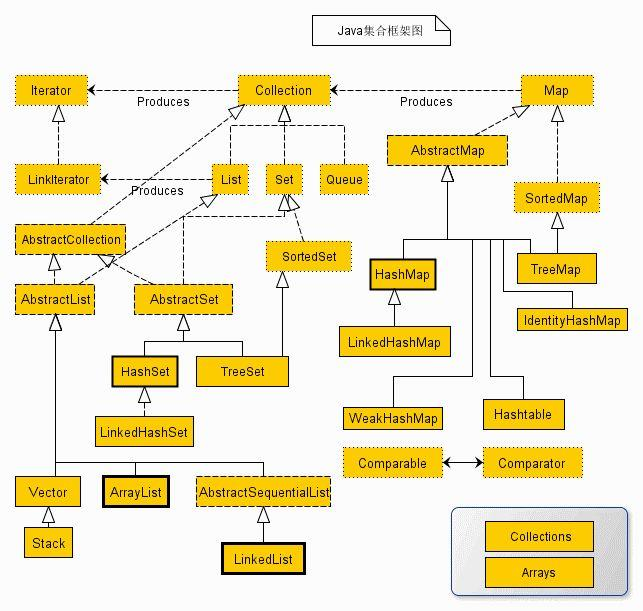
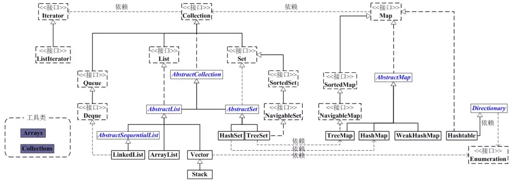

# 集合 Collection

Java 集合 Collection 简单说就是“持有对象”的容器。

Java 集合框架是 Java 开发中最常用的 API 之一，它提供了一套统一的接口和实现类，用于存储和操作对象。

Java 集合框架的整体架构设计，采用 接口 `Interface` 和 实现 `implementation` 的分层设计，具体表现为 **接口 - 抽象类 - 实现类**。

- 接口 Interface 是抽象的，约定了一套访问容器的方法。
- 实现 Implementation 包括抽象类和实现类，可以通过不同的方式来实现接口的方法。

这样的架构设计有以下优势：

- 接口标准化：通过统一接口（如`List`）定义行为，实现类（如`ArrayList`）可灵活替换，符合 "面向接口编程" 思想。
- 功能分层：抽象类（如`AbstractList`）实现接口的通用方法，减少实现类的代码冗余（如`addAll()`、`contains()`等）。
- 工具类支持：`Collections`和`Arrays` 类提供排序、同步化等工具方法（如`Collections.sort(list)`、`Collections.synchronizedMap(map)`）。

> 接口-实现这样的面向接口编程思想，在 JavaEE 中体现的更为明显，比如 jakarta EE 规范中都是接口规范，而 Tomcat 等都是该规范的实现。



简化分析：


## 接口体系

集合有两个基本的接口类型 `Collection` 和 `Map`。

- `Collection` 接口：继承`Iterable` 接口，定义了序列化集合，定义了添加、删除、遍历等基础操作，主要子接口有：
  - `List`：有序可重复集合，实现的类有`ArrayList`、`LinkedList`
  - `Set`：无序不可重复集合，实现的类有`HashSet`、`LinkedHashSet`、`TreeSet`
  - `Queue`：队列（先进先出，实现的类有`LinkedList`、`PriorityQueue`、`ArrayDeque`
- `Map` 接口：存储键值对（key-value）集合，key 不可重复，主要实现类有：
  - `HashMap`：哈希表实现，无序
  - `TreeMap`：红黑树实现，按键排序
  - `LinkedHashMap`：哈希表 + 双向链表，保持插入顺序
  - `ConcurrentHashMap`：数组 + 链表 + 红黑树锁，线程安全，采用 CAS + synchronized 实现高并发，替代了过时的 Hashtable。

另外，还有两类接口支撑着集合方法的实现：

- `Iterator`：约定了集合元素迭代遍历的方法，`Collection` 接口继承至`Iterator` 接口，所以该`Collection` 的实现类都有迭代遍历的方法或者被 `forEach` 迭代遍历。
- `Comparator`: 约定了集合元素间比较的方法。

还有两个工具类：

- `Arrays`: 数组工具类，提供了一些静态方法，操作各种基本类型和引用类型的数组。
- `Collections`: 集合工具类，提供一些静态方法，用于操作 List、Set 等集合框架。

## 常用方法

| 集合类        | 核心属性与底层特征                                                                                                 | 核心方法与特性                                                                                                                                                                                                                                     |
| :------------ | :----------------------------------------------------------------------------------------------------------------- | :------------------------------------------------------------------------------------------------------------------------------------------------------------------------------------------------------------------------------------------------- |
| ArrayList     | 底层：动态数组（`Object[] elementData`）<br>初始容量：默认为 10<br>扩容机制：按原容量的 1.5 倍进行扩容             | 增：`add(E e)`, `add(int index, E e)`<br>删：`remove(int index)`, `remove(Object o)`<br>改：`set(int index, E e)`<br>查：`get(int index)`, `indexOf(Object o)`<br>其他：`size()`, `isEmpty()`, `contains(Object o)`, `subList(int from, int to)`   |
| LinkedList    | 底层：双向链表（节点包含 `prev`, `next`, `item`）<br>初始容量：无固定容量概念<br>扩容机制：无需扩容，动态增删节点  | List接口方法：`add(E e)`, `get(int index)`, `remove(int index)`<br>双端队列特有：`addFirst(E e)`, `addLast(E e)`, `getFirst()`, `getLast()`, `removeFirst()`, `removeLast()`<br>其他：`size()`, `clear()`, `contains(Object o)`                    |
| HashSet       | 底层：`HashMap` 实例（元素作为 Key，一个静态 Object 对象作为 Value）<br>初始容量：16<br>扩容机制：2 倍扩容         | 增：`add(E e)`（依赖 `hashCode` 和 `equals` 去重）<br>删：`remove(Object o)`<br>查：`contains(Object o)`<br>其他：`size()`, `isEmpty()`, `clear()`, `iterator()`<br>注意：元素无序，允许存储 null                                                  |
| LinkedHashSet | 底层：`LinkedHashMap`（在 HashMap 基础上增加了双向链表维护顺序）<br>初始容量：16<br>扩容机制：2 倍扩容             | 方法：与 `HashSet` 完全一致（`add`, `remove`, `contains`, `size` 等）<br>特性：在去重的基础上，严格维护元素的插入顺序                                                                                                                              |
| TreeSet       | 底层：`TreeMap`（红黑树结构）<br>初始容量：无<br>扩容机制：无（树结构动态生长）                                    | 增：`add(E e)`（按自然顺序或自定义比较器排序）<br>删：`remove(Object o)`<br>查：`contains(Object o)`<br>特有范围查询：`first()`, `last()`, `higher(E e)`, `lower(E e)`, `subSet(E from, E to)`<br>注意：元素自动排序，不允许存 null                |
| HashMap       | 底层：数组 + 链表 + 红黑树（JDK 1.8+）<br>初始容量：16<br>负载因子：0.75（容量 \* 0.75 > 元素个数时触发 2 倍扩容） | 增：`put(K key, V value)`<br>删：`remove(Object key)`<br>查：`get(Object key)`, `getOrDefault(Object key, V default)`<br>遍历：`keySet()`, `values()`, `entrySet()`<br>其他：`containsKey(Object key)`, `containsValue(Object value)`, `size()`    |
| TreeMap       | 底层：红黑树（自平衡二叉查找树）<br>初始容量：无<br>扩容机制：无                                                   | 增：`put(K key, V value)`（按键排序）<br>删：`remove(Object key)`<br>查：`get(Object key)`<br>特有范围查询：`firstKey()`, `lastKey()`, `subMap(K fromKey, K toKey)`, `headMap(K toKey)`, `tailMap(K fromKey)`<br>注意：键自动排序，键不允许为 null |
| LinkedHashMap | 底层：`HashMap` + 双向链表<br>初始容量：16<br>负载因子：0.75                                                       | 方法：与 `HashMap` 一致（`put`, `get`, `remove`, `entrySet` 等）<br>特性：维护了键值对的插入顺序；若开启 `accessOrder=true`，则维护访问顺序（常用于实现 LRU 缓存）                                                                                 |

```java
import java.util.*;

public class CollectionMethodsDemo {
    public static void main(String[] args) {
        // 1. List 的增删改查
        List<String> list = new ArrayList<>();
        list.add("A"); list.add("B"); // add
        list.set(0, "C");             // set (改)
        String val = list.get(1);     // get (查)
        list.remove("B");             // remove (删)

        // 2. Set 的去重与范围查询
        Set<Integer> treeSet = new TreeSet<>();
        treeSet.add(50); treeSet.add(10); treeSet.add(30);
        System.out.println(treeSet.first()); // 10 (TreeSet特有: 获取最小值)
        System.out.println(treeSet.subSet(20, 60)); // [30, 50] (TreeSet特有: 子集范围)

        // 3. Map 的存取与遍历
        Map<String, Integer> map = new HashMap<>();
        map.put("Alice", 25); // put (增)
        map.get("Alice");     // get (查)
        map.containsKey("Alice"); // containsKey (查键是否存在)

        // Map 推荐的高效遍历方式
        for (Map.Entry<String, Integer> entry : map.entrySet()) {
            System.out.println(entry.getKey() + " = " + entry.getValue());
        }
    }
}
```

Arrays 和 Collections 是 Java 中两个极其重要的工具类，它们都位于 java.util 包下，且内部的方法全部是静态方法，可以直接通过类名调用，无需创建实例。

Arrays 提供了排序、查找、复制、填充、比较以及将数组转换为字符串或集合等核心功能。

| 方法名         | 作用说明                                                       |
| :------------- | :------------------------------------------------------------- |
| sort()         | 对数组进行升序排序（支持全数组或部分范围排序）                 |
| binarySearch() | 使用二分查找法在已排序的数组中查找指定元素，返回其索引         |
| toString()     | 返回一维数组内容的字符串表示形式（如 `[1, 2, 3]`）             |
| deepToString() | 返回多维（如二维）数组内容的字符串表示形式                     |
| copyOf()       | 复制数组，可以指定新数组的长度（支持扩展长度或截断）           |
| copyOfRange()  | 复制数组的指定范围（遵循左闭右开原则）                         |
| fill()         | 用指定的元素值填充整个数组或数组的指定范围                     |
| equals()       | 比较两个数组的内容是否完全相等（元素个数和对应位置的值都相同） |
| asList()       | 将数组转换为一个固定大小的 List 集合                           |

Collections 提供了对集合进行排序、查找、替换、线程安全包装等丰富的操作。

| 方法名            | 作用说明                                                             |
| :---------------- | :------------------------------------------------------------------- |
| sort()            | 对 List 集合中的元素进行自然顺序（升序）排序，也支持传入自定义比较器 |
| binarySearch()    | 在已排序的 List 中使用二分查找法查找指定元素                         |
| reverse()         | 反转 List 集合中元素的顺序                                           |
| shuffle()         | 随机打乱 List 集合中元素的顺序                                       |
| fill()            | 使用指定元素替换 List 集合中的所有元素                               |
| copy()            | 将源 List 中的元素复制到目标 List 中（目标 List 长度需足够）         |
| max() / min()     | 根据自然顺序或自定义比较器，返回集合中的最大/最小元素                |
| frequency()       | 统计指定元素在集合中出现的次数                                       |
| replaceAll()      | 将 List 中所有等于旧值的元素替换为新值                               |
| synchronizedXxx() | 将非线程安全的集合（如 ArrayList, HashMap）包装成线程安全的集合      |
| unmodifiableXxx() | 返回一个不可修改的集合视图（任何修改操作都会抛出异常）               |

```java
import java.util.*;

public class UtilsDemo {
    public static void main(String[] args) {
        // --- Arrays 工具类演示 ---
        int[] arr = {5, 2, 8, 1, 9};

        // 1. 排序与转字符串
        Arrays.sort(arr);
        System.out.println("排序后的数组: " + Arrays.toString(arr)); // 输出: [1, 2, 5, 8, 9]

        // 2. 二分查找 (注意：必须先排序)
        int index = Arrays.binarySearch(arr, 8);
        System.out.println("元素 8 的索引: " + index); // 输出: 3

        // 3. 数组转 List
        List<Integer> listFromArray = Arrays.asList(10, 20, 30);
        System.out.println("数组转List: " + listFromArray); // 输出: [10, 20, 30]
        // 注意：asList 转换的 List 是固定大小的，不能进行 add 或 remove 操作


        // --- Collections 工具类演示 ---
        List<Integer> list = new ArrayList<>(Arrays.asList(5, 3, 8, 1, 3));

        // 1. 排序与反转
        Collections.sort(list);
        System.out.println("自然排序: " + list); // 输出: [1, 3, 3, 5, 8]
        Collections.reverse(list);
        System.out.println("反转后: " + list); // 输出: [8, 5, 3, 3, 1]

        // 2. 查找最值与统计频率
        System.out.println("最大值: " + Collections.max(list)); // 输出: 8
        System.out.println("元素 3 出现的次数: " + Collections.frequency(list, 3)); // 输出: 2

        // 3. 随机打乱
        Collections.shuffle(list);
        System.out.println("随机打乱后: " + list); // 输出: 每次运行顺序都不同
    }
}
```
