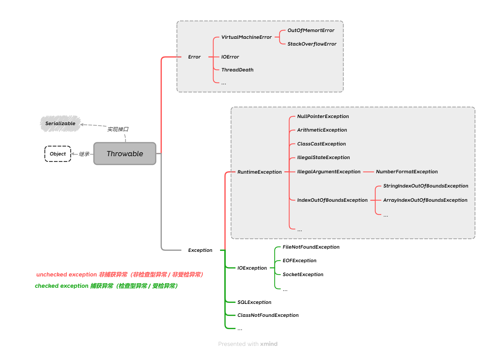

# 异常

异常，字面理解就是异于常态，和正常情况不一样了。

在编程中，异常是指程序运行过程中发生了非正常，不在预期逻辑内的的情况，这些情况会导致程序的提前终止。

为了处理这些异常情况，Java 提供了异常机制，JVM 在执行代码时检测到违反语义或资源约束的情况，就会抛出异常。

这个异常对象包含了异常的类型、异常的位置和异常的原因等信息，程序可以根据这些信息来判断异常的类型，并采取相应的处理措施。

## 为什么需要异常机制？

在没有异常机制的情况下，唯一的退出机制是`return`，判断是否异常的方法就是返回值。方法根据是否异常返回不同的返回值，调用者根据不同返回值进行判断，并进行相应处理。每一层方法都需要对调用的方法的每个不同返回值进行检查和处理，程序的正常逻辑和异常逻辑混杂在一起，代码往往难以阅读理解和维护。另外，因为异常毕竟是少数情况，程序员经常偷懒，假装异常不会发生，而忽略对异常返回值的检查，降低了程序的可靠性。

在有了异常机制后，程序的正常逻辑与异常逻辑可以相分离，异常情况可以集中进行处理，异常还可以自动向上传递，不再需要每层方法都进行处理，异常也不再可能被自动忽略，从而，处理异常情况的代码可以大大减少，代码的可读性、可靠性、可维护性也都可以得到提高。

## Java 的异常体系

在 Java 语言中，所有异常都是一个对象，语言内置的异常类的继承关系如下：



所有异常类的基类是 `Throwable` 类，它继承至 `Object` 类，并且实现了接口 `Serializable`。

它又派生出两个子类：`Error` 和 `Exception`。

- `Error` 类表示程序运行时，系统错误或者运行环境的错误，导致程序中断的严重错误。比如堆栈溢出`StackOverflowError`，内存不足`OutOfMemoryError`等。程序逻辑不需要处理这些错误。
- `Exception` 类：代表程序自身逻辑执行错误，可以被 Java 异常处理机制捕获和处理，是异常处理的核心。这类异常又分为两种：
  - `Checked Exception` 类：称为**捕获异常**，也有称为"检查型异常"或“受检异常”，简单说在程序逻辑上必须被捕获，接受检查的异常。**捕获异常一般由外界因素产生，并且可以在不需要修改源代码的情况下恢复的异常**，例如通过网络传输文件可能中途被终止传输了，但并不是由程序引起的，该异常可以恢复的。再比如，创建了网络套接字连接，可以会因为网络中断而连接失败抛出的异常。在程序中这些捕获异常必须显式处理（try-catch 捕获或者 throws 重新抛出），否则编译器会报错。
  - `Unchecked Exception` 类：称为**未捕获异常**，也有称为"非检查型异常"或“非受检异常”。**非捕获异常一般是由程序逻辑错误导致的异常，这类异常通常需要修改源代码才能解决**，比如空指针异常`NullPointerException`通常需要增加`if (obj == null)` 判断逻辑防御。其中 `RuntimeException` 类及其子类都属于这类未捕获异常。在程序逻辑中可以选择处理，也可以不处理。

> 摘自《Java 编程的逻辑》 6.3.6 对比受检和非受检异常
> 一种普遍的说法是：
>
> 未受检异常表示编程的逻辑错误，编程时应该检查以避免这些错误，比如空指针异常，如果真的出现了这些异常，程序退出也是正常的，程序员应该检查程序代码的 bug 而不是想办法处理这种异常。
>
> 受检异常表示程序本身没问题，但由于 I/O、网络、数据库等其他不可预测的错误导致的异常，调用者应该进行适当处理。（标注：感觉这种外在因素导致的异常更不应该由程序处理，而应该由调用者处理）。
>
> 但其实任何编程错误也是应该进行处理的，尤其是 Java 被广泛应用于服务器程序中，不能因为一个逻辑错误就使程序退出。所以，目前一种更被认同的观点是：Java 中对受检异常和未受检异常的区分是没有太大意义的，可以统一使用未受检异常来代替。
>
> 这种观点的基本理由是：无论是受检异常还是未受检异常，无论是否出现在 throws 声明中，都应该在合适的地方以适当的方式进行处理，而不只是为了满足编译器的要求盲目处理异常，既然都要进行处理异常，受检异常的强制声明和处理就显得烦琐，尤其是在调用层次比较深的情况下。
>
> 其实观点本身并不太重要，更重要的是一致性，一个项目中，应该对如何使用异常达成一致，并按照约定使用。

## Throwable 类

`Throwable` 类是 Java 异常机制的基类，它定义了异常的基本属性和方法。所有的异常类都是 `Throwable` 类的子类，包括 `Error` 和 `Exception` 类。

`Throwable` 类还定义了四个构造方法：

- `Throwable()`：创建一个新的 `Throwable` 异常对象，没有详细信息。
- `Throwable(String message)`：创建一个新的 `Throwable` 异常对象，包含指定的详细信息。
- `Throwable(String message, Throwable cause)`：创建一个新的 `Throwable` 异常对象，包含指定的详细信息和原因。
- `Throwable(Throwable cause)`：创建一个新的 `Throwable` 异常对象，包含指定的原因。

`Throwable` 类的主要方法如下：

- `getMessage()`：返回异常的详细信息字符串。
- `printStackTrace()`：将异常的堆栈跟踪输出到标准错误流。
- `toString()`：返回异常的简单名称和详细信息字符串。
- `getCause()`：返回异常的原因。
- `initCause(Throwable cause)`：初始化异常的原因。
- `fillInStackTrace()`：填充异常的堆栈跟踪信息。

## 抛出异常

如果程序在运行过程中发生了异常，那么系统（JVM）将会根据异常的类型，在异常代码处创建对应的异常类型的对象并抛出，抛出给程序的调用者。一旦抛出对象以后,其后的代码不再运行，直到被捕获处理，如果一直未被处理，程序终止.

异常抛出分为：

- 自动抛出：系统（JVM）检测到异常情况，会自动抛出异常。
- 手动抛出：在程序中主动使用 `throw` 语句抛出异常。

我们主要学习如何通过 `throw` 语句手动抛出异常。它的语法如下：

```java
throw new ExceptionType("异常信息");
```

`throw` 语句后接一个异常对象，使用 `new` 语句创建一个异常对象，然后抛出。其中 `ExceptionType` 是异常的类型，`"异常信息"` 是可选的异常详细信息。

## 捕获异常

在 Java 语言中，可以捕获异常的方式，包括：

- `throws` 语句：用于声明方法可能抛出的异常，将异常传递给调用者处理。
- `try-catch-finally` 语句：用于捕获并处理异常。
- `try-with-resources` 语句：用于自动关闭资源，避免资源泄漏。

### `throws` 语句

处理异常最简单的方式是不处理，将异常抛出直接向上抛出，直到被其它方法捕获处理，或者最终未处理终止程序。

但是 Java 语法的异常机制有一个要求，如果当前方法可能会抛出一个受检异常（Checked Exception），并且在该方法中没有被捕获处理，需要向上抛出时，那么必须在方法签名中使用 `throws` 语句显式声明抛出该异常。

`throws` 语法规则：

```java
public void method() throws ExceptionType1, ExceptionType2, ... {
    // 方法体
}
```

其中 `ExceptionType` 是异常的类型，可以声明多个异常类型，多个异常类型之间用逗号隔开。

这个语法声明表示方法内可能抛出这些异常，且没有对这些异常进行处理，至少没有处理完，调用者必须进行处理。作为一个良好的实践，应该将这些信息用注释的方式进行说明，这样调用者才能更好地处理异常。

语法规则：

- 对于未受检异常（Unchecked Exception），不要求在方法签名中使用 `throws` 语句声明抛出，因为它们不需要被显式处理。
- 对于受检异常，不可以抛出了但没有声明，但允许声明了抛出异常但实际在方法内部被处理了而没有抛出。
- 子类重写父类的方法时，子类的方法不能抛出比父类方法没有声明的受检异常，只能抛出父类方法声明的异常或其子类异常。

```java
// IO异常都是受检异常
import java.io.FileInputStream;
import java.io.FileNotFoundException;

public class ThrowsExample {
    /**
     * 文件读取可能抛出的异常：FileNotFoundException，直接向上抛出给方法调用都处理
     */
    public static void readFile(String fileName) throws FileNotFoundException {
        FileInputStream fis = new FileInputStream(fileName);
    }


    public static void main(String[] args) {
        // 方法调用者使用 try-catch 捕获异常
        try {
            readFile("nonexistent.txt");
        } catch (FileNotFoundException e) {
            System.out.println("文件未找到: " + e.getMessage());
        }
    }

}
```

### try-catch-finally

`try-catch-finally` 语句用于捕获并处理异常，确保程序在发生异常时能够正常退出，避免程序崩溃。

```java
try {
    // 可能会抛出异常的代码
} catch (ExceptionType1 e1) {
    // 处理 ExceptionType1 异常的代码
}
```

`catch` 语句块内进行异常处理，根据异常的类型不同，进行多重捕获，进行不同的处理。但是多重捕获时，需要注意先捕获子类异常，再捕获父类异常，否则子类异常捕获不到。

```java
try {
    // 可能会抛出异常的代码
} catch (ExceptionType1 e1) {
    // 处理 ExceptionType1 异常的代码
} catch (ExceptionType2 e2) {
    // 处理 ExceptionType2 异常的代码
}
```

如果处理多种异常的逻辑类似，可以使用 `|` 操作符合并捕获多个异常类型。

```java
try {
    // 可能会抛出异常的代码
} catch (ExceptionType1 | ExceptionType2 e) {
    // 处理 ExceptionType1 或 ExceptionType2 异常的代码
}
```

`finally` 语句块无论是否发生异常，都会执行的代码，通常用于释放资源，例如关闭文件、数据库连接等。

执行规则：

- 无论是否发生异常，`finally` 语句块都会执行。
- 如果在 `try` 语句块中没有发生异常，在 try 内代码执行结束后，继承执行 `finally` 语句块。
- 如果在 `try` 语句块中发生了异常，并且在 `catch` 语句块被捕获处理了异常，那么等 catch 内代码执行结束后，执行 `finally` 语句块。
- 如果在 `try` 语句块中发生了异常，并且在 `catch` 语句块没有被捕获处理，那么执行 `finally` 语句块结束后，然后将异常向上抛出。
- 如果在 `finally` 语句块中使用了 `return` 语句，会覆盖 `try` 或 `catch` 语句块中的 `return` 返回值
- 如果在 `finally` 语句块内抛出了异常，会覆盖 `try` 或 `catch` 语句中的异常，向上抛出 `finally` 语句中的新异常。

最佳实践是为避免混淆，应该避免在 `finally` 中使用 `return` 语句、被动或主动抛出异常，如果调用的其他代码可能抛出异常，则应该再使用 `try-catch` 捕获异常并进行处理。

```java
try {
    // 可能会抛出异常的代码
} catch (ExceptionType1 e1) {
    // 处理 ExceptionType1 异常的代码
} catch (ExceptionType2 e2) {
    // 处理 ExceptionType2 异常的代码
} finally {
    // 无论是否发生异常，都会执行的代码
    // 例如关闭文件、数据库连接等
}
```

示例代码：

```java
public class FinallyExample {
    /**
     * 这个函数的返回值是0，而不是2。finally 语句中不能改变返回值
     * 实际执行过程是：在执行到try内的return ret；语句前，会先将返回值ret保存在一个临时变量中，然后才执行finally语句，最后try再返回那个临时变量，finally中对ret的修改不会被返回。
     */
    public static int finallyModifyVariable () {
        int result = 0;
        try {
            return result;
        } finally {
            result = 2;
        }
    }

    /**
     * 这个函数的返回值是2，而不是0。
     * finally中有return 会覆盖try和catch内的返回值。
     */
    public static int finallyReturn () {
        int result = 0;
        try {
            return result;
        } finally {
            return 2;
        }
    }

    /**
     * 这个函数的返回值是2，而不是抛出异常。
     * 5/0 会触发ArithmeticException，但是finally中抛出了异常会覆盖try和catch内的异常，新异常向上传递。
     */
    public static int finallyThrow () {
        int result = 0;
        try {
            int a = 5/0;
            return result;
        } catch (ArithmeticException e) {
            return 1;
        } finally {
            throw new RunningException("finally throw exception");
            // return 2;
        }
    }
}
```

## try-with-resources

对于一些使用资源的场景，比如文件和数据库连接，典型的使用流程是首先打开资源，最后在 finally 语句中调用资源的关闭方法。

```java
public class TryCatchFinallyResourceExample {
    public static void useResource() throw Exception {
        // 创建资源
        AutoCloseable r = new FileInputStream("nonexistent.txt");
        try {
            // 读取文件内容
        } finally {
            // 关闭资源
            r.close();
        }
    }
}
```

针对这种场景，Java 7 开始支持一种新的语法，称之为 try-with-resources，这种语法针对实现了 `java.lang.AutoCloseable` 接口的对象，该接口的定义为：

```java
public interface AutoCloseable {
    void close() throws Exception;
}
```

使用示例：

```java
public class TryWithResourcesExample {
    public static void useResource() throws Exception {
        try (AutoCloseable r = new FileInputStream("nonexistent.txt")) { // 创建资源
            // 读取文件内容，r.close() 会在 try 语句执行结束后自动调用
        }
    }
}
```

在 IO 操作中，文件流、数据库连接、网络套接字等资源都实现了 `AutoCloseable` 接口，所以可以使用 `try-with-resources` 语法来确保资源在使用完毕后被关闭。也可以自定义业务资源的场景类，通过实现 `AutoCloseable` 接口，来确保资源在可以使用 `try-with-resource` 语法。

```java
public class MyResource implements AutoCloseable {
    @Override
    public void close() throws Exception {
        // 关闭资源
    }
}

// 使用
public class TryWithResourcesExample {
    public static void useResource() throws Exception {
        try (MyResource r = new MyResource()) { // 创建资源
            // 处理逻辑
        }
    }
}
```

## 自定义异常

Java 内置了这么多异常类，其中并没有比 `Throwable` 这个基类添加了多少新属性和方法，大部分子类在继承父类后只是重新定义了几个构造方法。

那为什么定义这么多不同的类呢？主要是为了名字不同。异常类的名字本身就代表了异常的关键信息，无论是抛出还是捕获异常，使用合适的名字都有助于代码的可读性和可维护性。

在项目开发中，根据业务逻辑的不同，为了更明确地表示异常信息，我们也可以自定义异常类。比如某些错误是业务特有的，比如“用户余额不足”、“订单状态不允许退款”。用 `IllegalArgumentException` 虽然也能凑合，但语义模糊，不利于排查和日志分析。对某一类底层异常做精细化异常处理，但又不想影响其他情况。例如，同样是 `FileNotFoundException`，可能是文件名非法导致的，也可能是路径权限问题。通过自定义异常可以区分对待。

因为存在”受检异常”和”非受检异常”的区别，所以自定义异常类也需要根据业务场景来确定是否定义“受检异常”还是“非受检异常”。

- 自定义“受检异常”：只需要继承 `Exception` 或者它的某个子类（除`RuntimeException` 类和它的子类）。
- 自定义“非受检异常”：只需要继承 `RuntimeException` 类或者它的子类。

```java
/**
 * 和很多内置异常类一样，我们没有定义额外的属性和代码，只是继承了Exception，定义了构造方法并调用了父类的构造方法。
 * 但是可以命名一样更表意的异常类名称，比如 IncorrectFileNameException 等。
 */
public class CustomException extends Exception {
    // 通常不会使用无参构造方法，因为没有错误信息，语义不明确。
    // 通常会使用一个至少接收 String 参数的构造函数，并传递给父类。否则你在抛出时没法带上具体的错误信息。
    // public CustomException() {
    //     super();
    // }
    public CustomException(String message) {
        super(message);
    }
    public CustomException(Throwable cause) {
        super(cause);
    }

    // 通常也会定义一个接收 String 和 Throwable 参数的构造函数，用于在抛出异常时传递错误信息和异常链，避免把原始异常给丢了，不方便排查日志。
    public CustomException(String message, Throwable cause) {
        super(message, cause);
    }
}
```

## 最佳实践

异常大概可以分为三种来源：用户、程序员、第三方。

- 用户是指用户的输入有问题；
- 程序员是指编程错误；
- 第三方泛指其他情况，如 I/O 错误、网络、数据库、第三方服务等。

每种异常都应该进行适当的处理。处理的目标可以分为恢复和报告。恢复是指通过程序自动解决问题。报告的最终对象也可能是程序使用的用户，也可能是系统运维人员或程序员。报告的目的也是为了恢复，但这个恢复经常需要人的参与。

- 对用户，如果用户输入不对，可以提示用户具体哪里输入不对；如果是编程错误，可以提示用户系统错误、建议联系客服；如果是第三方连接问题，可以提示用户稍后重试。
- 对系统运维人员，他们一般不关心用户输入错误，而关注编程错误或第三方错误，对于这些错误，需要报告尽量完整的细节，包括异常链、异常栈等，以便尽快定位和解决问题。
- 对程序员编写程序逻辑来说，不管是用户输入信息，还是第三方系统，都不应该是可靠的输入，应该有判断和容错机制。比如，对用户输入信息进行校验，有错进行提示；对第三方服务连接不上，程序应该能够处理这个异常，而不是直接抛出。

异常处理的一般逻辑：

- 如果自己知道怎么处理异常，就进行处理；
- 如果可以通过程序自动解决，就自动解决；
- 如果异常可以被自己解决，就不需要再向上报告。
- 如果自己不能完全解决，就应该向上报告异常，让调用者知道异常的发生。如果有额外信息可以提供，有助于分析和解析问题，就应该提供，比如将原异常使用 `cause` 参数重新抛出。
