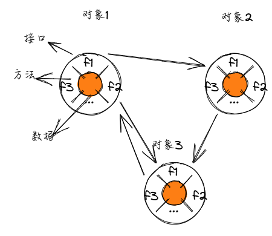

# 封装

Java 语言是面向对象的语言，封装是面向对象的一个重要特性，实践了开放封闭原则（Open Closed Principle）：

- 封闭：将数据（成员变量）和操作这些数据的方法（成员方法）组合在一个类中，隐藏类的实现细节。
- 开放：只暴露必要的接口（公开的方法），java 中实现了一套访问控制机制，通过声明不同的访问修饰符来控制类、成员变量和方法的可访问性。

> 开放封闭原则（Open-Closed Principle, OCP）是面向对象设计中的核心原则之一，强调软件实体（如类、模块、函数等）应该对扩展开放，对修改封闭。这一原则旨在提高软件的可维护性、可扩展性和灵活性，降低因需求变化而导致的修改成本。



## 封装的好处

- 数据安全性：通过将数据封装在类中，类的内部实现细节对外部是隐藏的，外部只能通过类提供的公开方法来访问和操作数据，在操作数据的方法中可以进一步校验传入数据的合法性，从而保护数据的安全性。
- 代码维护性：因为隐藏了数据和方法的实现细节，当数据结构和方法变化时，这种变化被限制在内部的局部范围内，但保持接口（公开的方法）的相对稳定，使得这种内部变化的影响不会波及到其它相关联的对象。
- 可扩展性：封装为系统的扩展提供了便利。可以在不影响现有代码的情况下，对封装类进行功能扩展。

## 访问修饰符

Java 提供了四种访问修饰符，用于控制类、成员变量和成员方法的访问权限：

- `public`：可以在任何地方访问。
- `default`：默认修饰符，没有关键字。可以在本包内的其他类中访问。
- `protected`：可以在本类、本包内的其他类以及继承了本类的子类（即使子类与父类不同一个包）中访问。
- `private`：只能在本类中访问。

其中针对类的访问控制，只适用 `public` 和 `default` 两种情况。

## public

public 公共访问级别是类的访问控制级别中用得数量较多的一种。不管是类还是其它成员，当被修饰为 public 时，可以在任何地方访问。

## default

> default 涉及到包的概念，相关概念可以从[包 package](./oop_package.md)中了解。

default 是缺省时，默认的访问级别，不管是类还是其它成员，当没有使用任何访问修饰符时，就是 default 访问级别。

default 访问级别下，类只能在同一个包内的其他类中被访问，不能在不同包的类中被访问。

## protected

protected 不可用于类，只用于成员。在 protected 访问级别下，成员可以被同一个包内的其他类访问，也可以被不同包的子类访问。

> protected 涉及到继承的概念，相关概念可以从[继承](./oop_inheritance.md)中了解。

## private

private 私有访问级别，只能在本类中被访问。

以下表格总结了 `private`、`default`、`protected` 和 `public` 在不同场景下的访问权限：

| 访问修饰符  | 同一个类中 | 同一个包中 | 继承的子类中 | 其它不同包的类 |
| ----------- | ---------- | ---------- | ------------ | -------------- |
| `private`   | ✅         | ❌         | ❌           | ❌             |
| `default`   | ✅         | ✅         | ❌           | ❌             |
| `protected` | ✅         | ✅         | ✅           | ❌             |
| `public`    | ✅         | ✅         | ✅           | ✅             |

## 代码示例

通常，我们会将类的成员变量声明为 private，并通过 public 的 getter 和 setter 方法对外提供访问接口，是实现数据隐藏的常见方式。

这样，外部类无法直接访问和修改对象的内部数据，只能通过定义好的接口进行操作，而且可以在 setter 方法中对传入的数据进行校验，从而保护数据的安全性。

```java
public class Person {
    // 成员变量，使用private修饰，对外隐藏
    private String name;
    private int age;

    // Getter方法，用于获取成员变量的值
    public String getName() {
        return name;
    }

    // Setter方法，用于设置成员变量的值
    public void setName(String name) {
        this.name = name;
    }

    // Getter方法
    public int getAge() {
        return age;
    }

    // Setter方法，添加简单的数据验证
    public void setAge(int age) {
        if (age >= 0 && age <= 120) {
            this.age = age;
        } else {
            System.out.println("年龄不合法");
        }
    }
}
```

以下是封装的一些常用实践。

## JavaBean

JavaBean 是一种遵循特定设计模式的 Java 类，它具有以下特征：

- 类是公共的（public）。
- 有一个无参的构造方法。
- 所有成员变量都是 private 修饰的。
- 提供 public 公有的 getter 和 setter 方法来访问和修改成员变量。

遵循 JavaBean 规范可以使代码更加规范和易于理解，同时也便于与其他 Java 技术（如 Java EE、Spring 等）集成。

```java
public class Employee {
    private String name;
    private int id;

    public Employee() {
    }

    public Employee(String name, int id) {
        this.name = name;
        this.id = id;
    }

    public String getName() {
        return name;
    }

    public void setName(String name) {
        this.name = name;
    }

    public int getId() {
        return id;
    }

    public void setId(int id) {
        this.id = id;
    }
}
```

## 不可变对象

不可变对象是指一旦创建，其状态就不能被修改的对象。创建不可变对象可以提高代码的安全性和并发性。

不可变对象的实现方式有很多种，下面是其中一种实现方式：

- 将类的成员变量声明为 final，确保一旦初始化就不能被修改。
- 不提供 setter 方法，只提供 getter 方法。
- 构造方法中初始化所有成员变量。

```java
public final class Range {
    private final int start;
    private final int end;

    public Range(int start, int end) {
        this.start = start;
        this.end = end;
    }

    public int getStart() {
        return start;
    }

    public int getEnd() {
        return end;
    }
}
```

像这种固定模板的不可变类，在 Java 16 中引入了记录（record）类，记录类是一种特殊的不可变类，它可以更方便地创建不可变对象。

```java
// 定义
record Range(int start, int end) {}

// 使用
Range range = new Range(0, 10);
System.out.println(range.start()); // 0
System.out.println(range.end()); // 10
```

关于记录类的详细介绍，可以参考[记录类](./oop_record.md)。

## 最小化访问性

最小化访问性是指将类的成员变量和成员方法的访问权限设置为最小的级别，只在必要的情况下才暴露给外部。

- 将类的成员变量声明为 private，只在类的内部访问。
- 将类的成员方法声明为 public，只在类的外部访问。
- 只在必要的情况下才暴露给外部的成员变量和成员方法。
