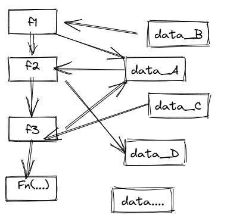

# 面向对象编程

> 以下内容摘自 《Java 开发手册》 ch6.1

软件开发的过程就是人们使用各种计算机语言将自身关心的现实世界（问题域）映射到计算机世界（目标域）的过程。

```
现实世界问题域 +--> 建立模型    +-->  编程实现     +--->  计算机世界
               借助某种建模思想    借助某种编程语言         执行求解

```

## 对象

对象是现实世界中的事物，在人脑中的映像，这种映像通过对同一类事物的抽象，反应在人脑中的意识，并作为一种概念而存在。这个概念就是现实世界当中的事物在人们意识当中的抽象。只要这个对象存在于人们的思维意识当中，人们就可以借此判断同类的东西。

例如，当人们认识到一种新事物，它叫苹果，看到它是圆形的，可以吃，味道是甘甜的，于是人脑中就形成了苹果的概念，知道它的特征（苹果的颜色、形状、重量等）和行为（苹果可以吃、可以被人吃、可以用来榨汁等）。

## 面向对象

面向对象（Object-Oriented）是一种方法或者思想，它追求更客观，更自然的描述现实世界，使得分析、设计和实现软件系统跟认识客观世界的过程尽可能的一致。

客观世界是由许多不同种类的对象构成的，每一个对象都有自己的运动规律和内部状态，不同对象之间相互联系、相互作用。

面向对象技术从组成客观世界的对象着眼，通过抽象，将对象映射到计算机系统中，又通过模拟对象之间的相互作用、相互联系来模拟现实客观世界，描述客观世界的运动规律。

## 面向对象编程

面向对象编程（Object-Oriented Programming，OOP）是将面向对象技术在计算机中通过编程实现。

从编程开发的角度来看，所谓对象被定义为一个封装了状态（数据）和行为（操作方法）的实体。

程序员可以通过定义一个对象集合，以及它们之间的相互作用来创建一个面向对象的程序，让许多对象协同工作来完成一个用户需要的软件系统。

### 面向过程编程模式

传统的过程化程序设计通过设计一系列的过程（即算法）来求解问题。这些过程一旦被确定，下一步就要开始寻找存储数据的方式。

在面向过程编程模式中，数据和方法（封装了算法的函数）是分开的，相当是开发人员看到的是函数的集合以及单独的一批数据。

程序的处理过程为：参数输入 → 函数 → 结果输出，其编程模式大致如图所示。



这种模式下，对于软件维护人员来说，无论是函数还是数据结构的改动，都会使整个程序受到干扰，进而可能引发软件系统的崩溃，可以说是“牵一发而动全身”​，程序的维护和扩展几乎难以进行。

### 面向对象编程模式

在面向对象编程模式中，数据和方法（封装了算法的函数）被封装在被称为对象的实体中，对象之间的数据访问是间接的，是通过接口进行的。这里所说的接口是指当前对象为其他对象访问提供的一套访问方法。其编程模式如图所示。


> 有一个很好的比喻：通常将对象比作鸡蛋，蛋黄是数据，蛋清是访问数据的函数，蛋壳代表接口（即那些公开 public 的方法）​。蛋壳接口隐藏了私有方法和数据结构的实现细节，保证了算法程序的稳定性，除非蛋壳破裂（接口发生变化）​。

对象的接口隐藏了数据和方法的实现细节，当数据结构和方法变化时，这种变化被限制在内部的局部范围内，但保持接口的相对稳定，使得这种内部变化的影响不会波及到其它相关联的对象。

这样，相比面向过程编程模式，通过使用面向对象编程模式，解决了面向过程中“牵一发而动全身”的问题，大大提高程序的灵活性和可维护性。

通常认为**程序 = 数据 + 算法**，在面向过程编程模式中，算法是第一位的，而数据结构是第二位的。而 OOP 则调换了这个次序，将数据放在第一位，之后再考虑操纵数据的算法。

### 面向对象编程的特征

在 OOP 中，程序被看作相互协作的对象集合，每个对象都是某个类的实例，所有类构成一个通过继承关系相联系的层次结构。

所以面向对象的语言通常具有以下实现：

- 类和遗传机制。
- 对象生成功能。
- 消息传递机制。

这些实现机制使得 OOP 具有以下特征：

- 封装：将数据和操作数据的方法封装在一起，形成一个对象。
- 继承：一个类可以派生出新的类，新的类可以继承父类的属性和方法，并且可以添加新的属性和方法。
- 多态：一个对象可以有多种形态，即一个对象可以是不同的类的实例。
