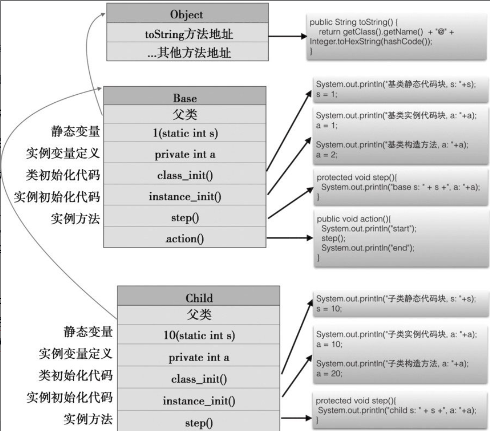
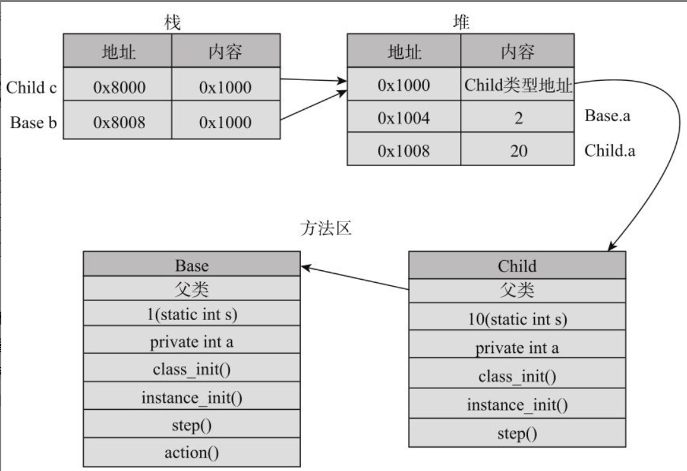
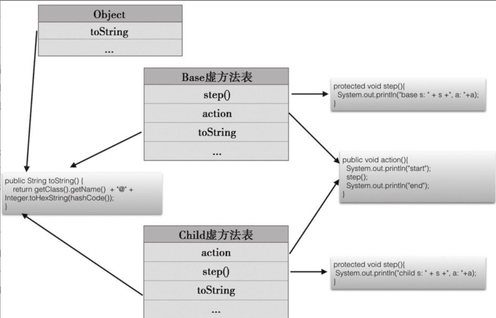

# 多态

多态（Polymorphism）一词来源于希腊语，意思是“多种形式”。在 Java 中，多态的简单理解：就是调用对象的同一个方法，会实现多种不同的行为。

多态的实现机制有三种：

- 基于参数的多态：实现机制是**方法重载**
- 基于继承的多态：实现机制是**方法重写**
- 基于接口的多态：实现机制是**接口实现**

## 方法重载实现多态

```java
public class OverloadExample {

    // 方法重载1：接收两个整数
    public int add(int a, int b) {
        return a + b;
    }

    // 方法重载2：接收两个小数
    public double add(double a, double b) {
        return a + b;
    }

    // 方法重载3：接收三个整数
    public int add(int a, int b, int c) {
        return a + b + c;
    }

    public static void main(String[] args) {
        OverloadExample example = new OverloadExample();
        System.out.println(example.add(1, 2));         // 输出：3
        System.out.println(example.add(1.5, 2.5));     // 输出：4.0
        System.out.println(example.add(1, 2, 3));      // 输出：6
    }
}
```

`example.add` 方法根据参数的不同，分别实现整数、小数、2 个或 3 个参数加法逻辑，这就是方法重载实现的多态。

## 方法重写实现多态

```java
// 父类：动物类
class Animal {
    public void sound() {
        System.out.println("动物发出声音");
    }
}

// 子类：狗类
class Dog extends Animal {
    @Override
    public void sound() {
        System.out.println("狗叫：汪汪汪");
    }
}

// 子类：猫类
class Cat extends Animal {
    @Override
    public void sound() {
        System.out.println("猫叫：喵喵喵");
    }
}

// 测试运行时多态
public class OverrideExample {
    public static void main(String[] args) {
        Animal animal; // 父类引用

        animal = new Dog();
        animal.sound(); // 输出：狗叫：汪汪汪

        animal = new Cat();
        animal.sound(); // 输出：猫叫：喵喵喵
    }
}
```

变量 animal 可以被赋值任何 Animal 子类型的对象，可以表现为 Dog 或 Cat，而且子类中实现了各自的 sound 方法，这就是方法重写实现的多态。

对于变量 animal，它就有两个类型：

- 类型 Animal，称其为**静态类型**，也可以叫做编译时类型
- 类型 Dog 或 Cat，称其为**动态类型**，也可以叫做运行时类型

调用 `animal.sound()` 方法时，会根据对象的动态类型，调用对应的 sound 方法，这就是多态的表现。

## 接口实现多态

```java
// 支付接口
interface IPayment {
    void pay(double amount);
}

// 微信支付实现
class WeChatPay implements IPayment {
    @Override
    public void pay(double amount) {
        System.out.println("使用微信支付：" + amount + " 元");
    }
}

// 支付宝支付实现
class AliPay implements IPayment {
    @Override
    public void pay(double amount) {
        System.out.println("使用支付宝支付：" + amount + " 元");
    }
}

// 新增信用卡支付实现
class CreditCardPay implements IPayment {
    @Override
    public void pay(double amount) {
        System.out.println("使用信用卡支付：" + amount + " 元");
    }
}

// 测试支付系统
public class PaymentTest {
    public static void main(String[] args) {
        Payment payment;

        payment = new WeChatPay();
        payment.pay(100); // 输出：使用微信支付：100 元

        payment = new AliPay();
        payment.pay(200); // 输出：使用支付宝支付：200 元

        payment = new CreditCardPay();
        payment.pay(300); // 输出：使用信用卡支付：300 元
    }
}
```

变量 payment 可以被赋值任何实现 IPayment 接口的对象，然后在运行时，根据被赋值对象的实现类型，分别实现 WeChatPay、AliPay 或 CreditCardPay 的支付功能，这就是接口实现的多态。

对于变量 payment，同样有静态类型和动态类型：

- 静态类型（编译时类型）：IPayment
- 动态类型（运行时类型）：WeChatPay、AliPay 或 CreditCardPay

调用 `payment.pay()` 方法时，同样会根据对象的动态类型，调用对应的 pay 方法，就是接口多态的表现。

可以发现，基于继承的多态和基于接口的多态，都是通过方法重写实现的（基于继承的多态，是在子类中重写父类的方法，而基于接口的多态，是在实现类中重写接口的抽象方法）。

所以多态的实现机制可以再次归纳为：

- **方法重载实现多态，在编译阶段决定调用哪个方法。也叫编译时多态**
- **方法重写实现多态，在运行阶段根据对象的动态类型，调用对应的方法。也叫运行时多态**

这里引申出几个概念：

- 向上转型：是指将子类对象赋值给父类引用，例如 `Animal animal = new Dog();`
- 向下转型：是指将父类对象赋值给子类引用，例如 `Dog dog = (Dog) animal;`
- 静态绑定：是指在编译阶段，根据变量声明的类型，就能确定调用哪个方法。
- 动态绑定：是指要在运行阶段，根据实际赋值对象的类型，才能确定调用哪个方法。

## 向上转型

是指将子类对象赋值给父类引用，例如 `Animal animal = new Dog();`

## 向下转型

是指将父类对象赋值给子类引用，在语法上需要进行强制类型转换，例如 `Dog dog = (Dog) animal;`。

但是，向下转型时不一定能够转换成功。一个父类的变量能不能转换为一个子类的变量，取决于这个父类变量的动态类型（即引用的对象类型）是不是这个子类或这个子类的子类。

```java
Base b = new Child();
Child c = (Child) b; // 成功

Base b = new Base();
Child c = (Child) b; // 运行时异常：ClassCastException
```

给定一个父类的变量，想要知道它到底是不是某个子类的对象，从而安全地进行类型转换，可以使用 `instanceof` 关键字，看下面代码：

```java
Base b = new Child();
if (b instanceof Child) {
    Child c = (Child) b; // 安全的向下转型
} else {
    System.out.println("b 不是 Child 类型的对象");
}
```

## 静态绑定

静态绑定是指在编译阶段，根据变量声明的类型，就能确定调用哪个方法。

## 动态绑定

动态绑定是指要在运行阶段，根据实际赋值对象的类型，才能确定调用哪个方法。

## 继承和多态的实现原理

> 内容摘自 《Java 编程的逻辑》 4.3 节

下面通过一个例子，来理解继承和多态的实现原理，也可以解释静态绑定和动态绑定的原理。

## 1. 类的加载过程

在 Java 中，所谓类的加载是指将类的相关信息加载到内存。Java 类的加载过程中又细分为：

- 加载：将类的字节码文件加载到内存中
- 链接：验证字节码文件的正确性，为静态变量分配内存空间，将符号引用转换为直接引用
- 初始化：为静态变量赋值，执行静态代码块

java 中类是动态加载的，只有在第一次使用这个类的时加载一次。加载一个类时，会查看它的父类是否已经加载，如果没有，则会加载父类。

通常一个类中会包含以下部分：

- 类变量（静态变量）
- 类初始化代码（静态代码块）
- 类方法（静态方法）
- 实例变量
- 实例初始化代码（实例代码块）
- 构造方法
- 实例方法

在类加载过程中，分完成以下工作：

- 分配内存保存类的信息
- 给类的变量（静态变量）赋初始值
- 加载父类
- 设置父子关系
- 执行类初始化代码：先执行父类的初始化代码，然后执行子类的初始化代码。

在前面对象引用类型里提过，内存区域会被分为栈和堆，栈存放变量的值，而堆存储对象的内容。另外还会划分出一个内存区，用来存放类的信息，这个区在 java 中称为**方法区**。

类加载完成后，在方法区就会有一份类的信息，包括类的变量、方法、构造方法、父类等信息。



## 2. 创建对象的过程

在类加载之后，`new Child()` 就是创建 Child 实例对象。创建对象的过程中，会完成以下工作：

- 分配内存空间：会包括本类和所有父类的实例变量，但不包括任何静态变量，因为静态变量在类的加载过程中已经分配了内存。
- 对所有实例变量赋初始值
- 执行实例初始化代码：先执行父类的实例初始化代码，然后执行子类的实例初始化代码。在执行实例初始化代码中包括类构造函数的调用。

实例对象生成之后，每个对象除了保存有实例变量和方法的信息之外，还会保存一个指向当前类信息的引用，这个指针指向方法区中的该类信息的内存地址。

`Child c = new Child();` 会创建一个 Child 实例对象，然后将对象的引用赋值给变量 c。然后 `Base b = c;` 也会让 b 也引用到这个 Child 对象。

其中引用就是 c 和 b 分配在栈中，它胶指向相同的堆中 Child 对象。而 Child 对象中存储着方法区中 Child 类的信息的引用地址，在方法区中 Child 类的信息中存储着指向它父类 Base 类在方法区中的引用地址。



## 3. 变量访问过程

对变量的访问都是静态绑定的，无论是类变量和还是实例变量。

类变量（静态变量）在类的加载过程中就已经分配了内存和完成了初始化，随类的信息一起存储方法区。示例代码中的 `b.s / c.s` 在类加载过程中，JVM 会转换为直接使用类名调用 `Base.s / Child.s`，可以通过类引用直接访问到方法区里的变量值。

实例变量在对象创建时才会分配内存和完成初始化，随对象的信息一起存储在堆内存中。因对变量的访问都是静态绑定的，此时直接根据**变量的声明类型中开始查找**，如果没有找到，再从父类中查找。

- 在类内部访问，有几中变量访问方式`xx / this.xx / super.xx`，如果是 `xx / this.xx` 会从本类的变量中查找，如果没有找到，再从父类中查找。 `super.xx` 直接从父类中查找。
- 在类外部访问，只能通过对象访问 `b.b / c.b`，从引用变量的声明类型开始查找，如果没有找到，再从父类中查找。

## 4. 方法调用过程

方法的调用过程是动态绑定，实现的机制就是根据**赋值对象的实际类型**查找要执行的方法，子类型中找不到的时候再查找父类。

我们先来看 `c.action()`; ，这句代码的执行过程：

1. 查看 `c` 的对象类型，找到 Child 类型，在 Child 类型中找 action 方法，发现没有，到父类中寻找；
2. 在父类 Base 中找到了方法 action，开始执行 action 方法；
3. action 先输出了 start，然后发现需要调用 `step()` 方法，注意此时是在父类型的 action 方法调用 `step()` 方法，但是仍然是从 Child 类型开始寻找 `step()`方法；
4. 在 Child 类型中找到了重写的 `step()` 方法，执行 Child 中的 `step()` 方法，执行完后返回 action 方法；
5. 继续执行 action 方法，输出 end。

寻找要执行的实例方法的时候，是从赋值对象的实际类型信息开始查找的，而不是从引用变量的声明类型信息开始查找的。而赋值对象是代码运行时确定的，所以说方法的调用过程中动态绑定的。

> java 方法的调用过程，有点类似 javascript 语言中沿原型链查找变量和方法的过程。

## 虚方法表

如果继承的层次比较深，要调用的方法位于比较上层的父类，则调用的效率是比较低的，因为每次调用都要进行很多次查找。大多数系统使用一种称为虚方法表的方法来优化调用的效率。

**虚方法表**，就是在类加载的时候为每个类创建一个表，记录该类的对象所有动态绑定的方法（包括父类的方法）及其地址，但一个方法只有一条记录，子类重写了父类方法后只会保留子类的。


