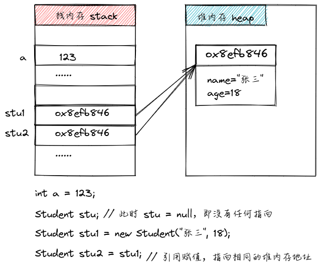

# 引用类型：数据保存在哪里

> 以下内容摘自《On Java 基础卷》 3.2.1 数据保存在哪里

可以简单理解为“程序 = 数据 + 算法”。数据保存在内存中，但对于内存读取的高效性来说，不同的数据类型有不同的存储方式。

常见的 5 种数据存储位置：

- 寄存器 register
- 栈 stack
- 堆 heap
- 常量存储 constant pool
- 非 RAM 存储 non-RAM storage

## 寄存器 register

寄存器（register）存储是速度最快的数据存储方式，它保存数据的位置不同于其他方式，数据会直接保存在中央处理器(central processing unit, CPU)里。寄存器是 CPU 的一部分，内部的一种高速存储设备，通常用于存储当前正在执行的指令和数据。寄存器的访问速度非常快，通常在一个时钟周期内就可以完成。

然而寄存器的数量是有限的，所以只能按需分配。大部分编程语言中不能直接通过程序控制寄存器的分配，甚至你在程序中都找不到寄存器存在过的证据（C 和 C++是例外，它们允许你向编译器申请分配寄存器）​。

## 栈 stack

栈 stack 属于随机存取存储器（random access memory, RAM）划分出的一部分内存区域。处理器可以通过栈指针(stack pointer)直接操作该数据。具体来说，栈指针向下移动将申请一块新的内存，向上移动则会释放这块内存。这是一种极其迅速和高效的内存分配方式，其效率仅次于寄存器。在 java 程序中，通常基本数据类型的变量都是存储在栈中的。

## 堆 heap

堆 heap 属于随机存取存储器（random access memory, RAM）划分出的一部分内存区域。这个一块通用内存池，是一种动态分配内存的数据结构，用于存储对象实例。堆的访问速度相对较慢，但使用非常灵活。

Java 中的对象都是存储在堆中的。对象的创建和销毁都是由 Java 虚拟机（Java Virtual Machine, JVM）负责的。当你创建一个对象的 new 语句被执行时，JVM 就会在堆上为该对象分配内存空间。当对象不再被引用时，JVM 会自动回收该对象的内存空间。然而这种灵活性是有代价的，分配和清理堆存储要比栈存储花费更多的时间 ​。好消息是，随着时间的推移，JVM 的堆内存分配机制已经变得非常高效了，所以你并不需要太过关注此类问题。

## 常量存储 constant storage

常量存储是一种特殊的内存区域，用于存储常量值，如字符串常量、整数常量等。在某些系统中，常量存储可能会被保存到只读存储器（read only memory ROM）中，以防止程序修改常量值。

## 非 RAM 存储 non-RAM storage

非 RAM 存储是指存储在外部设备中的数据，如果一段数据没有保存在应用程序里，那么该数据的生命周期既不依赖于应用程序是否运行，也不受应用程序的管制。

其中最典型的例子之一是“序列化对象”(serialized object)，它指的是转换为字节流（叫作“序列化”​）并可以发送至其他机器的对象。

另一个例子则是“持久化对象”(persistent object)，它指的是保存在磁盘上的对象，而这些对象即便在程序结束运行之后也依然能够保持其状态。

这些数据存储类型的特点在于，它们会将对象转换成其他形式以保存于其他媒介中，然后在需要的时候重新转换回常规的 RAM 对象。Java 支持轻量级的持久化对象存储，而 JDBC 以及 Hibernate 等库则提供了更为成熟的解决方案，即支持使用数据库存取对象信息。

## 基本数据类型的存储

有一些你经常使用的数据类型会享受特殊待遇，你可以将它们称为“基本类型”(primitive type)。它们之所以享受特别待遇，是因为 new 关键字是在堆上创建对象，这就意味着哪怕是创建一些简单的变量也不会很高效。

所以，对于基本类型，Java 使用了与 C 以及 C++相同的实现机制，无须使用 new 来创建基本类型的变量，而是直接创建一个“自动变量”(automatic variable)，该变量会直接在栈上保存它的值，因此运行效率也较高。

## 引用类型的存储

一个基本类型变量，内存中只会有一块对应的内存空间，通常是在栈空间中直接存储对应的值。但对于对象的存储，内存中会有两块：一块是在堆内存中存储对象的内容本身，另一块是在栈中用于存储对象内容在堆内存的起始地址。

也基本类型相对，对象也被称为引用类型。因为一个声明一个对象变量，这个变量实际的值是对象内容的引用，它指向堆内存地址。

<<< ../../learnjava/src/com/learnjava/oop/object/ReferenceType.java

