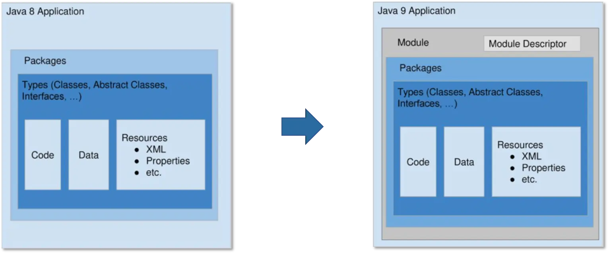

# 模块 module

Java 9 引入了模块系统（Java Module System，简称 Jigsaw），这是 Java 平台自诞生以来最大的一次架构性升级。

## What 什么是模块

模块是 Java 9 引入的一种新的代码组织方式，模块系统 Java Platform Module System，简称 JPMS，它将一个应用程序或库分解为多个模块，每个模块都有自己的代码、资源和依赖关系。

官方的定义是 A uniquely named, reusable group of related packages, as well as resources (such as images and XML files) and a module descriptor。翻译为：一个唯一命名的、可重复使用的相关包的集合，以及资源（如图像和 XML 文件）和模块描述符。



从图上可以看出，一个模块还是一个 jar 文件，但相比于传统的 jar 文件，模块的根目录下多了一个 Module Descriptor 文件（module-info.class）。也就是说，任意一个 jar 文件，只要加上一个合法的 module descriptor，就可以升级为一个模块。

这个看似微小的改变，到底可以带来哪些好处？也就是为什么需要使用模块的原因？

## Why 为什么要使用模块

## 解决依赖管理问题

在 Java 9 出现模块之前，`.class` 文件是 JVM 的最小可执行文件，而一个大型程序需要编写很多类，并生成一堆 `.class` 文件，对于源代码管理和程序分发都很不方便管理，所以使用 package 包来组织 class 文件。

一个大型 Java 程序通常会使用多个 package 包来组织代码，包括引用外部依赖的第三方 jar 包，最后打包成一个 jar 文件进行分发。比如 Java 自身的标准库，实际上也是以 jar 文件形式存在的，这个文件就是 `rt.jar`，一共有 60M。

在程序运行时，`java` 命令通常需要描述完整当前程序依赖的外部 jar 包，通常会有以下几种方式来指定程序依赖的 jar 包：

- 可以在 `java` 命令中使用 `-jar` 选项来明确指定要运行的 jar 文件
- 或者使用 `--class-path` 或 `-cp` 选项来指定类路径，类路径声明的目录中可以包含多个 jar 文件。
- 或者在程序 jar 包的 `MANIFEST.MF` 文件中指定 `Class-Path` 头，值为多个 jar 文件的路径，用空格隔开。

如果漏写某个程序依赖的 jar 包，程序在运行时会抛出 `ClassNotFoundException` 异常。

在以包组织的程序中，只是通过 `class-path` 声明了程序依赖的 jar 包，但是并不能确保程序运行时所有的类都在类路径中，也不关心各个类之间的依赖关系，所以通常也只在运行时才会报 `ClassNotFoundException` 异常。

比如 `a.jar` 必须依赖另一个`b.jar`才能运行，那我们应该给`a.jar`加点说明啥的，让程序在编译和运行的时候能自动定位到`b.jar`，如果没有，在编译期就能报错提示，这种自带“依赖关系”的 class 容器就是模块。

有了模块系统，Java 可以根据 module descriptor 计算出各个模块间的依赖关系，一旦发现循环依赖，启动就会终止。同时，由于模块系统不允许不同模块导出相同的包（即 split package，分裂包），所以在查找包时，Java 可以精准的定位到一个模块，从而获得更好的性能。

## 强封装

尽管包访问权限提供了有效的隐藏，使类不能在该包外使用，但实际上还是可以使用反射来规避它。比如在反射代码中通过 `setAccessible(true)` 方法来改变类中私有成员的访问权限，从而破坏封装性，这是非常危险的。

而在模块中，明确了更为严格的封装规则，类只能在其所属的模块中访问，而不能在其他模块中访问，也没有什么反射的特权，除非在模块的 module-info.java 文件中显式声明了 `opens` 指令，才允许反射访问。

## 精简 JRE

在 java9 模块出现之前，打包一个 Jar 文件时，通常会包含整个 Java 标准库，这意味着即使最简单的程序也带有大量从未使用过的库代码。假设你使用了组件 A，之前的 Java 语言没有提供任何支持来告诉编译器，组件 A 依赖了哪些其他组件。如果没有这些信息，编译器唯一能做的就是将整个 Java 库包含在内。

引入模块系统之后，JDK 自身被划分为 94 个模块。通过 Java 9 新增的 jlink 工具，开发者可以根据实际应用场景随意组合这些模块，去除不需要的模块，生成自定义 JRE，从而有效缩小 JRE 大小。得益于此，JRE 11 的大小仅为 JRE 8 的 53%，从 218.4 MB 缩减为 116.3 MB，JRE 中广为诟病的巨型 jar 文件 rt.jar 也被移除。更小的 JRE 意味着更少的内存占用，这让 Java 对嵌入式应用开发变得更友好。

## How 如何使用模块

上面提到，模块的核心在于 module descriptor，即模块描述符。对应于根目录下的 `module-info.java` 文件，文件内容中定义了模块的名称、依赖关系、导出的包、服务等信息。

## module-info.java

Java 为 module-info.java 设计了专用的语法，包含 module、 requires、exports 等多个关键词，用于描述模块的名称、依赖关系、导出的包、服务等信息。

module-info.java 的语法规则如下：

```java
[open] module <module-name> {
    // 声明当前模块依赖的其他模块
    requires [transitive] <module-name>;

    // 声明当前模块导出的包，可选的 to 子句指定哪些模块可以访问这些包
    exports <package-name> [to <module-name-1>[, <module-name-2>...]];

    // 声明当前模块打开的包，可选的 to 子句指定哪些模块可以反射访问这些包
    opens <package-name> to <module-name-1>[, <module-name-2>...];

    // 声明当前模块提供的服务，可选的 with 子句指定服务的实现类
    provides <service-name> with <provider-class-name>;

    // 声明当前模块使用的服务
    uses <service-name>;
}
```

语法解读：

- `[open] module <module>`: 声明一个模块，模块名称应全局唯一，不可重复。加上 open 关键词表示模块内的所有包都允许通过 Java 反射访问，模块声明体内不再允许使用 opens 语句。
- `requires [transitive] <module>`: 声明模块依赖，一次只能声明一个依赖，如果依赖多个模块，需要多次声明。加上 transitive 关键词表示传递依赖，比如模块 A 依赖模块 B，模块 B 传递依赖模块 C，那么模块 A 就会自动依赖模块 C，类似于 Maven。
- `exports <package> [to <module1>[, <module2>...]]`: 导出模块内的包（允许直接 import 使用），一次导出一个包，如果需要导出多个包，需要多次声明。如果需要定向导出，可以使用 to 关键词，后面加上模块列表（逗号分隔）。
- `opens <package> [to <module>[, <module2>...]]`: 开放模块内的包（允许通过 Java 反射访问），一次开放一个包，如果需要开放多个包，需要多次声明。如果需要定向开放，可以使用 to 关键词，后面加上模块列表（逗号分隔）。
- `provides <interface | abstract class> with <class1>[, <class2> ...]`: 声明模块提供的 Java SPI 服务，一次可以声明多个服务实现类（逗号分隔）。
- `uses <interface | abstract class>`: 声明模块依赖的 Java SPI 服务，加上之后模块内的代码就可以通过 ServiceLoader.load(Class) 一次性加载所声明的 SPI 服务的所有实现类。
